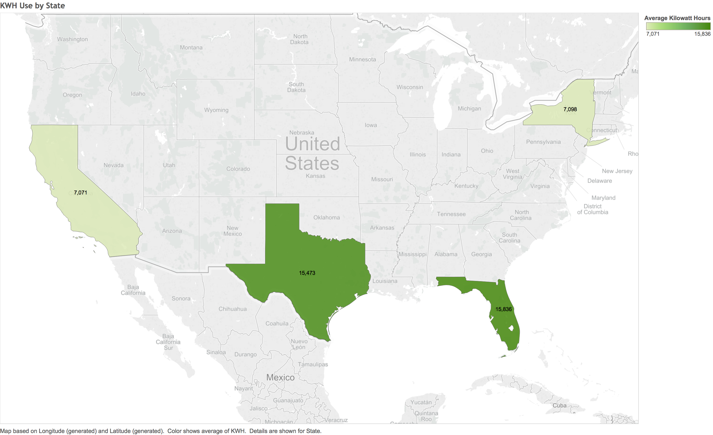

  ---
title: "Profiling Household Energy Consumption"
author: "Alan Colver, Matthew Herpich"
date: "May 8, 2016"
output: html_document
---

```{r setup, include=FALSE}
knitr::opts_chunk$set(echo = TRUE)
```

## Abstract
Understanding the nation's energy usage patterns is critical to building a sustainable infrastructure and reducing/mitigating consumption. Identifying areas of waste and opportunities to implement resource-saving practices could drastically reduce the cost of various energy types. Significant time, money, and effort has been invested in the "smart grid", a blending of the nation's existing energy infrastructure with modern technologies and adaptive learning algorithms.  Prime examples of this include Nest and Google's Power Meter, both of which attempt to learn from and predict energy usage patterns with the goal of helping reduce excess power consumption.  This problem is highly complex, with multiple sources of power per household and numerous potential predictors of consumption, including demographic features and household attributes.

In our data mining analysis, we will look at the profiles of approximately 5,000 households based on publically-available energy consumption data collected by the Energy Information Administration ("EIA") to identify patterns related to the usage of electriciy and natural gas. From this data, we will: (1) identify the most significant predictors of energy consumption based on the data; (2) train models to help predict total energy consumption and the impact certain features have on overall consumption; and (3) recommend ways homeowners and landlords can reduce energy consumption. 

## Introduction
Energy consumption in U.S. households consists primarily of electric power and natural gas usage but also may include LPG, fuel oil, kerosene, and other products.  The purpose of this project was to integrate energy consumption data based on the Residential Energy Consumption Survey from 2005 with certain demographic and household information also provided by the survey.  The dataset of interest had 3 main components: (1) energy consumption data, including power, natural gas, LPG, and kerosene, both in native units and in BTU, found in the energy_consumption.csv file; (2) household measurements, including total square footage, square footage by room, square footage of heated versus unheated portions, and square footage of cooled versus uncooled portions, in the house.csv file; and (3) demographic information of the owner(s) of the household, including number of members, age of members, employment status, work status, and income bracket, found in the household.csv file.  These files were all linked together by a DOEID which served as the Foreign Key.

In total, this dataset was fairly rich.  The energy consumption data had total energy consumption by product but also estimated consumption for each product by end use.  For power consumption, the data was subdivided into dryer use, dishwater use, freezer use, and others, while for natural gas consumption, the data included appliance and heating uses.  Though a significant number of output variables was present, most of the data collected was for electric power and natural gas usage.  Given these tend to be the predominant sources of household energy, we focused on these two metrics (and the aggregate sum).  The house.csv file consisted of 30 potential attributes primarily revolving around square footage measures in total and by household room.  The household.csv file contained 28 attributes related to demographic data associated with each household.  Thus, in total, there were over 15 viable outputs and nearly 60 potential predictors from which to choose.

To analyze this data, we relied on standard statistical programming packages found in the R library plus supplementary tools including Excel and Tableau.  This report is merely meant to serve as an introduction to the project and our initial results.  The methodologies utilized here can be further refined and expanded to create a tailored and customized solution.

## Method and Result
### Data Preparation
As mentioned above, the source data for the project was publicly available and based on the Residential Energy Consumption Survey from 2005 as sourced from the EIA.  The three Excel files were linked via a DOEID which served as the Foreign Key, and all attribute variables were identified in a Code Book produced by the EIA.  In total, there were 4382 unique measurements across 89 attributes (excluding DOEID).

The first part of the project revolved around importing the data into an R database and sanitizing the data.  Many measurements in the set were "NA" or set to a default parameter (e.g., 9999) which meant no data or information skipped.  Before any thorough analysis was run, we outlined steps needed to sanitize this data to make it suitable for analysis, as discussed in the following sections.

#### Removing Columns
We quickly realized that not all attributes had meaningful amounts of data with which to run predictive algorithms.  While processes such as sampling or predictive modeling can help eliminate NULL or unknown values, if an attribute contains mostly unknown data, we believe these techniques may be creating a sense of false precision in the model's predictive capabilities.  As a result, we implemented code to remove features in the data set if greater than 50% of the values were either missing/default or "NA". In particular, we noticed that many of the output variables revolving around energy consumption from fuels other than electric power or natural gas contained insufficient measurements per our algorithm.  This makes sense - most households don't use significant volumes of kerosene, LPG, or other fuel sources (these are more for industrial purposes).  As a result, we limited our approach to predicting power usage, natural gas usage, and total usage as defined by power plus natural gas usage. 

#### Accounting for Missing Data
For the features which remained after the initial level of pruning, we implemented two methodologies to remove the NULL/default or "NA" values.  For almost all features, we replaced each instance of a NULL/defaut or "NA" with a sampled value from the non-NULL elements of that feature.  This approach maintains the shape of the feature distributions while simultaneously avoids discarding observations which could be of importance.  When dealing with total BTU consumption, almost all of the observations had numeric values for power usage; however, many of the natural gas usage values were NULL.  To create a more accurate output set, we implemented a linear regression model for BTU usage by the remaining non-consumption features and replaced the NULL/default values with the regressed output.

#### Creation of New Features
We found the feature set to be very fulsome and thus saw a limited need to create new features.  However, we did add a total BTU usage output based on the sumtotal of the electric power BTU usage and the natural gas usage.  This output variable would be a more fulsome/wholistic representation of a typical household's energy consumption  profile, particularly in the Northern U.S.  We also noted that there were features for the age of each member of a household and for the total number of household members but not one for the average age of a household member.  Given the hypothesis that the elderly tend to use less energy than younger families, we thought it could be significant in forming a predictive analysis.

### Feature Selection
How much energy a household uses is a complex matter: it is potentially determined by many variables. Additionally, as mentioned previously, the dataset from the EIA has a rich set of features from which to run predictive algorithms.  For the first part of the project, we wanted to identify which aspects of the homes and the homeowners contribute the most to their energy use. By focusing our efforts on the most impactful factors, we can identify which changes could potentially yield the best results for clients who wish to better predict or reduce their overall energy consumption.

#### Recursive Feature Elimination
Recursive Feature Elimination ("RFE"") is a method of identifying the most valuable features by building many models with all the variables and removing those that have little reduction to the total error. Running this method on our input data, we can see that there are several key features that explain much of the variance and that a majority of the features contribute only a little to the overall variability of the data. We used 10-fold validation on RFE to avoid over-fitting our results.


And now, if we zoom in, we can see our most useful variables:


| Variable | Description                                       | Root Mean Squared Error |
| -------- | ------------------------------------------------- | ----------------------: |
| NHSLDMEM | Number that live in the household                 | 0.1035                  |
| TYPEHUQ  | Type of home (e.g. single-family, apartment, etc) | 0.2412                  |
| HD65     | Number of heat-degree days (65 base temp)         | 0.3515                  |
| TOTHSQFT | Total home square feet                            | 0.3958                  |
| TOTSQFT  | Total square feet                                 | 0.4165                  |
| LRGSTATE | Is a large state (i.e. CA, FL, NY, TX)            | 0.4151                  |

Our results show that the number of household members contributed the most to reducing the error in our model. This is likely due to the more frequent usage of appliances by household members. The other findings are also pretty self evident. The type of home is typically associated with square footage. The number of heat degree days clearly would be related to total heat usage during cooler periods. Square footage is obviously related with how much heating/cooling is required for a household.

The large states, however, have more to do with geography and less to do with population. The graph below shows KWH usage by state. And as can be expected, the lower/warmer states use more electricity for cooling their homes.




#### Principal Component Analysis
Another way to understand the impact our variables have on energy usage is to examine how the variables interact with each other. We can do this through Principal Component Analysis ("PCA"). With PCA, we transform the variables into Principal Components which represent the orientations of maximum dispersion amongst the features (allowing for easier delineations among feature sets). These components are a weighted combination of the variables and capture the interplay amongst these variables through retained variance of the underlying dataset. They are arranged by how much each component contributes to the variance, with the first Principal Component contributing the most to the overall retained variance.

We can see in the graph below that our most explanatory component (PC1) is square footage, and its opposite is the type of home (TYPEHUQ), with higher category number typically denoting smaller home types (e.g., apartments). This finding is intuitive. Larger homes take more energy to regulate temperature, and smaller homes require less.


Principal Component 2 (PC2), however, reveals an interesting finding. It appears that older persons tend to use less energy. We can see that the older the primary owner is (AGEHHMEM1) and whether or not they are in retirement (RETIREPY) is associated with lower energy consumption. Conversely, we see that those who are working (WORKPAY) and have more people at home (NHSLDMEM) (e.g., young families) use more energy. One hypothesis is that older persons are more experienced with home ownership. They have more years of home ownership and have thus optimized the heating/cooling of their homes to reduce costs. An alternative hypothesis is that older people tend to use common appliances with less frequency than younger individuals, couples or families.  The elderly often cook and do laundry less and typically don't have significant number of energy-consuming appliances running simultaneously.  Also, it is likely that the elderly are more cost conscious and careful to not be wasteful with energy usage by leaving appliances running when out or not in use.  Larger families or households with kids likely tend to be less conservative when monitoring energy use given the large number of appliances and constant needs for running dishwashers and laundry.

### Classification Algorithms
Given that this feature set and output set lend themselves to regression-type modeling with numeric outputs versus classification, the applicability of classification models on this data set was mitigated.  However, we did utilize classification models, namely the support vector machine ("SVM") and classification tree, to train models to help validate the importance of features presented during the Principal Component analysis on predicting low or high energy consumption per household.

To begin, we subdivided the output dataset (total energy usage) into three categories: (1) "Low" - energy usage below 1 standard deviation from the mean; (2) "High" - above 1 standard deviation from the mean; and (3) "Normal" - within one standard deviation from the mean.  We then trained the SVM and classification tree models on the PCA data set utilizing cross validation to predict accuracy rates.  We realized that these models contained very high accuracy rates but low rates of identification for "Low" or "High" values given the number of "Normal" values was too broad.  Thus, we tuned the standard deviation parameter to 0.5 * standard deviation and re-ran our analysis.  The important element of the feature selection component of this project was to be able to accurately pinpoint those features which differentiated low or high household energy consumption; thus, we emphasized the importance of "anomoly" detection in household energy consumption over model accuracy.  As shown below, this led to a relatively even set of classifications.


After feeding this output with the top 24 PCA components (representing 90% of the underlying variance of the dataset) to the classification algorithms, we were able to achieve a meaningful improvement over the default predictor set (mode value predictor) with respect to accuracy while also identifying over 50% of the "low" and "high" cases.  The SVM model performed the best, averaging 62% accuracy over the cross validation folds utilizing the PCA data.

```{r}
#The average accuracy for the svm model is:  0.6191562 
#The identification rate for high values is:  0.5596026 
#The identification rate for low values is:  0.5477387 

#The average accuracy for the tree model is:  0.5359179 
#The identification rate for high values is:  0.5860927 
#The identification rate for low values is:  0.4874372 

#The average accuracy for the default model is:  0.4287343 
#The identification rate for high values is:  0 
#The identification rate for low values is:  0 
```

While the classification models did not help quantify the impact individual features had on household energy consumption (done using predictive algorithms as described below), the models did validate the PCA feature selection findings did significantly outperform the average selection when categorizing household energy consumption as "low", "high", or "normal".  Thus, we can conclude that there is a significant determining factor with respect to the features emphasized in the first set of Principal Components which does contribute to anomolous energy usage based on the average household profile as represented in the data set.

###Predictive Algorithms
Finding predictive relationships between household measurements and demographic information and the energy consumption profile of a household will ultimately help homeowners and tenants estimate projected energy usage and help homeowners and business owners with reducing their carbon footprints.  There are the more apparent predictive relationships, such as the relationship between total BTU usage and total household square feet or total BTU usage and number of heat degree days (shown below).  There are also less obvious predictive relationships, such as the average age of a household member, the type of housing unit or wall, and the work status of the household owner.  Additionally, the dataset contained variables which were both continuous value and which were classifiers (for example, type of home had 5 possible responses, 1:5).  Depending on how the classifier variables were ordered, a line or a quadratic function may make sense to predict across classifier values (see below for examples).

```{r,echo=FALSE}
import.csv <- function(filename){
  return(read.csv(filename,sep="," ,header=TRUE))
}
my.data <- import.csv("cleaned_data_FINAL.csv")
par(mfrow=c(1,2),oma=c(0,0,2,0))
plot(my.data$TOTSQFT,my.data$TOTBTU,main="BTU Usage Vs Household Square Feet",xlab="Square Feet",ylab="BTU",cex.lab=0.75,cex.main=1)
plot(my.data$HD65,my.data$TOTBTU,main="BTU Usage Vs Heat Deg-Days (Base 65)",xlab="HD65",ylab="BTU",cex.lab=0.75,cex.main=1)
title("Continuous Predictors",outer=T, cex.main=2)
par(mfrow=c(1,2), oma=c(0,0,2,0))
plot(my.data$TYPEHUQ,my.data$TOTBTU,main="BTU Usage Vs Type of House",xlab="House Type",ylab="BTU",cex.lab=0.75,cex.main=1)
plot(my.data$NHSLDMEM,my.data$TOTBTU,main="BTU Usage Vs Number of Household Members",xlab="Members",ylab="BTU",cex.lab=0.75,cex.main=1)
title("Discrete Predictors",outer=T,cex.main=2)

```

For the predictive part of this project, we focused on three main energy consumption output variables: (1) total electric power usage; (2) total natural gas usage (more prevalent in the Northern U.S.; commonly used for heating and cooking); and (3) total BTU usage of power and natural gas combined.  As the predictive model would need to take many input features and output an estimated energy usage, we focused our predictive analysis on multivariate regression models.  After exploring numerous types of linear and non-linear regression models and running such models through cross validation techniques, we settled on training three types of model for our final analysis: (1) the standard linear model; (2) the standard linear model with quadratic features for continuous variables; and (3) the decesion tree regression model.  We then performed one final cross validation on these three models and included the default predictor for comparitive purposes (generates the mean output for all inputs).  The root mean squared error ("RMSE") results shown below are for total BTU consumption using a five-fold cross validation of the data set with training/validation splits of 80%/20%. 

```{r}
#The RMSE of the quadratic fit is:  37598.02 
#The RMSE of the linear fit is:  37715.17 
#The RMSE of the tree predictor is:  41841.85 
#The RMSE of the default predictor is:  51258.91 
```

As shown above, the linear regression model with the ability to tune quadratic parameters (up to third order) for the most significant continuous feature variables performed the best on the test data, slightly edging the standard linear model.  The tuned decision tree regression model also meaningfully outperformed the default data set but failed to match the result of the linear and quadratic models.

The quadratic regression model reduced RMSE by 25% for all three output types (BTU, power, natural gas) as shown below.

```{r, echo=FALSE}
quadfit<-c(37598,19546,31433)
defvec<-c(51259,25612,42495)
redvec<-(quadfit-defvec)/defvec
resframe<-data.frame
resframe<-cbind(FitRMSE=quadfit,DefRMSE=defvec,PercRed=redvec)
print(resframe)
```

But is this result statistically significant?  We first run a paired t-test on the vector of squared errors from both the quadratic predictor and the default predictor for BTU.  As we expect, the result is to reject the NULL hypothesis and conclude the predictor model reduces the squared error.  We then run a paired t-test on the vector of squared errors from the quadratic predictor and the tree regression.  Again, the result is to reject the NULL hypothesis.  Finally, we run the paired t-test on the quadratic versus linear model.  Here we obtain a p-value of 7%.  Thus, for an alpha of 5%, we cannot reject the NULL hypothesis.  In summary, we can conclude that both the linear and quadratic models beat the default and tree predictors but that the quadratic may not statistically outperform the linear with 95% confidence.

```{r}
#Quadratic versus Default
#data:  SE1 and SE4
#t = -10.564, df = 876, p-value < 0.00000000000000022
#Quadratic versus Tree
#data:  SE1 and SE3
#t = -4.5547, df = 876, p-value = 0.000005988
#Quadratic versus Linear
#data:  SE1 and SE2
#t = -1.8042, df = 876, p-value = 0.07155
```

Finalizing our regression models now allows us to measure the corresponding change of energy consumption by predictor variable and is a powerful tool when analyzing features which can potentially reduce a household's carbon footprint.  Sample coefficients for the non-quadratic terms of the regression model are pasted below.  As an example, the coefficient for the NHSLDMEM (number of household members) variable is 7961.  Thus, we know that for each person increase in the number of household members, a household should expect its total BTU consumption to increase by nearly 8,000 BTU holding all other predictors constant.

```{r}
#  (Intercept)              TYPEHUQ                 CD65             WALLTYPE         ...    NHSLDMEM     ...  
#     13036574.517305         -6340.832303             7.175452         -1316.502376  ...     7960.587455 ...
```

####Predicting Energy Consumption By Use
Another informative component of this data set is that it includes estimated breakdown of total power and natural gas usage by category.  For power consumption, for example, each record in the data set can be broken apart into dryer use, dishwasher use, freezer use, refrigerator use, AC use, water heater use, space heater use, and other appliance use.  For natural gas consumption, each record in the data set can be broken apart into appliance use, water heater use, and space heater use.  This creates another layer to the predictive capabilities of this model in that the consumption profile by end use can potentially be mapped onto the feature set.  Thus, we can see more granular details around estimated energy consumption, like total power consumption by AC/heater by type of or age of building or total appliance consumption based on number of household members.

The plots below show the average breakdown of energy consumption for both power and natural gas based on the data set.  As clearly illustrated, general electric appliance use on average accounts for nearly 50% of all power consumption by household, with AC and refrigerator being the next significant power sinks.  On the natural gas side, the vast majority of natural gas is used for heating purposes, both for household heating and for water heaters.

```{r,echo=FALSE}
library(ggplot2)
x1<-c("Dryer","Dishwasher","Freezer","Refigerator","AC","Water Heater","Space Heater","Other Appliance")
y1<-c(0.06,0.01,0.04,0.14,0.16,0.08,0.06,0.44)
x2<-c("Appliance","Water Heater","Space Heater")
y2<-c(0.18,0.38,0.44)
data1<-data.frame(x=x1,y=y1)
data2<-data.frame(x=x2,y=y2)
h1 <- ggplot(data1, aes(x=x1,y=y1)) + geom_bar(fill="blue",stat="identity")+ggtitle("Average Power Consumption By Type")+theme(plot.title = element_text(face="bold"))+labs(x="Type",y="Percent of Total")
h2 <- ggplot(data2, aes(x=x2,y=y2)) + geom_bar(fill="blue",stat="identity")+ggtitle("Average Gas Consumption By Type")+theme(plot.title = element_text(face="bold"))+labs(x="Type",y="Percent of Total")
print(h1)
print(h2)

```

By training the same types of regression models on the full feature set by individual output, we can then enhance our overall predictive capabilities to have more detail than just household consumption.  For example, if we regress total other appliance usage (BTUELAPL - (BTUELCDR + BTUELDWH + BTUELFZZ)) against the full feature set and look at the number of household members (NHSLDMEM), we can expect a 1,960 BTU increase in power consumption for appliance for each additional member holding all other variables constant.  Another example would be if we regressed total AC usage (BTUELCOL) with the full feature set and look at the coefficient of CD65, or the number of cooling days set to 65 degree normalized temperature.  Given the coefficient is 4.9, we can glean that for each cooling day to 65 degrees, we can expect an incremental 5 BTU increase in our household AC power usage.  These are just a subset of potentially interesting feature-output predictive relationships we now can estimate using our regression models.

One interesting higher order trend to be mindful of is total BTU usage by household splitting electric power and natural gas.  Across the dataset, on average, household BTU consumption tended to run 40% power, 60% natural gas.  We know that gas is mostly used for heating purposes, particularly in the Northern U.S.  Thus, we should see a clear linear trend between BTUNG (total natural gas usage) and HD65 (heating days to 65 degrees).  Indeed, as evidenced by the plot below, there is an apparent linear trend between the variables (r=0.53).

```{r,echo=FALSE}
plot(my.data$HD65,my.data$BTUNG,main="Natural Gas Usage Vs Heat-Deg Days (Base 65)",xlab="HD65",ylab="BTU")
```


## Conclusion and Further Work
Our conclusions for this project revolve around the original stated goals and can be summarized as: (1) the ability to predict highly correlative features for household energy consumption is most certainly possible and achievable to a certain degree based on publically available data and (2) basic predictive modeling can estimate household energy consumption significantly better than merely taking averages across the feature set.  Though we had only 4382 data points, hardly a comprehensive data set when predicting for the average U.S. household, certain features definitely stood out as significant - total square footage, number of household memebers, type of household, number of heat-degree days, and how frequently the householder reporting being at home.  While these are somewhat intuitive, utilizing predictive regression modeling and feature selection algorithms helped to quantify the relative importance of these features to overall energy consumption and further elucidated relationships among more complex potential features (e.g., average age of household members, average age of house, wall type, employment status, and income type).  We feel confident that our first attempt at training predictive models can aid significantly in forming theses around the importance of various predictors on energy consumption, and given a more fulsome data set and higher-order regression modeling algorithms, we believe we can further tune these models to reduce the RMSE even more.

Having a predictive algorithm which accurately helps quantify household energy consumption and guide users on energy consumption reduction tips is already available (to varying degrees of quality) among tech-friendly energy appliances (the Nest home thermostat).  Continuing to improve these algorithms utilizing ever-expanding data sets which can be tuned to the specific end user is highy important to maintaining a carbon-reduction initiative in the U.S. and mitigating stress on the existing grid.  We would welcome the opportunity to utilize even more granular data with more measurements and additional dimensionality to improve upon our algorithms.


## Takeaways
This project did a great job of demonstrating the reality of practicing data mining techniques on real world datasets compared to the preprocessed examples that students are accustomed to working with. Real data sets are messy. Real data sets don't always have that one obvious correlation. There is a lot of noise and a lot of missing data. Given this new perspective, we now fully appreciate the significance of allocating the appropriate amount of time to understanding the variables and dealing with missing values.  We also grew to appreciate the importance of interacting with the client early on so as to tailor the data mining algorithms and procedures to the ask in order to create a useful output.  After having a brief discussion with the client to clarify expectations in Week 2 of the project, we formalized a well-defined plan of action. Doing this earlier would have saved man hours spent testing various approaches which ultimately did not prove fruitful.
